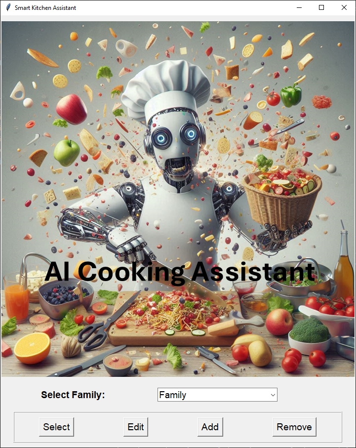
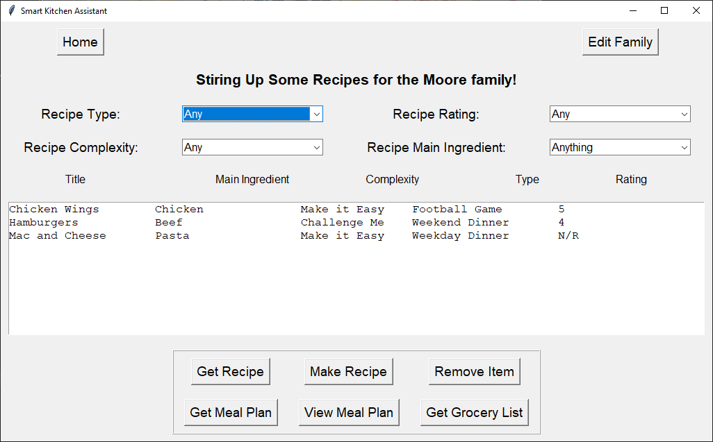
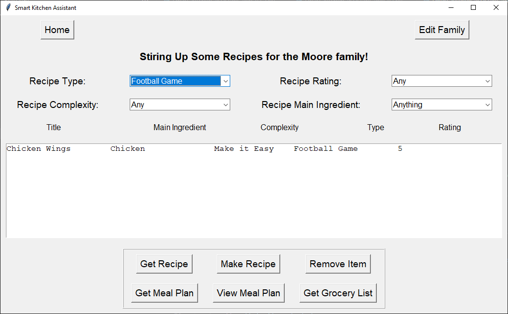
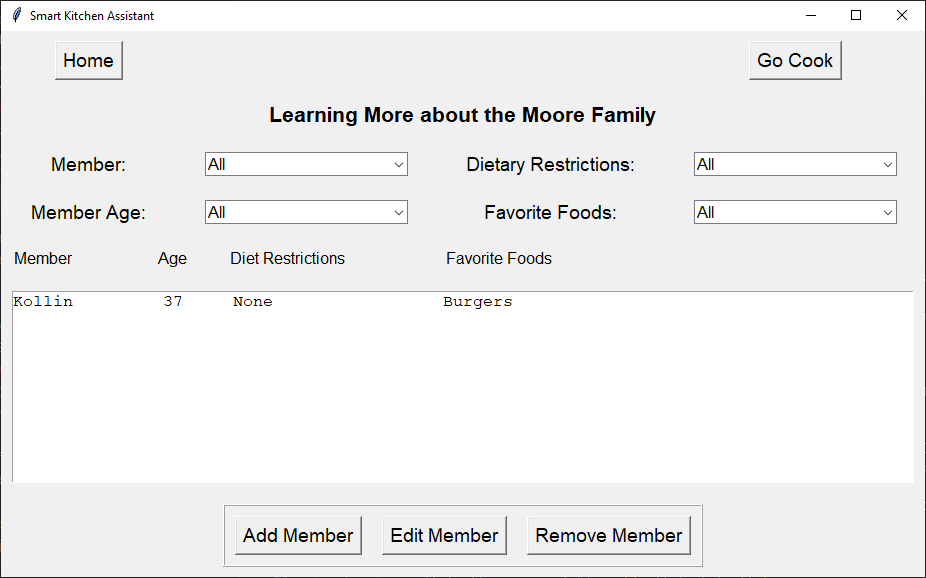
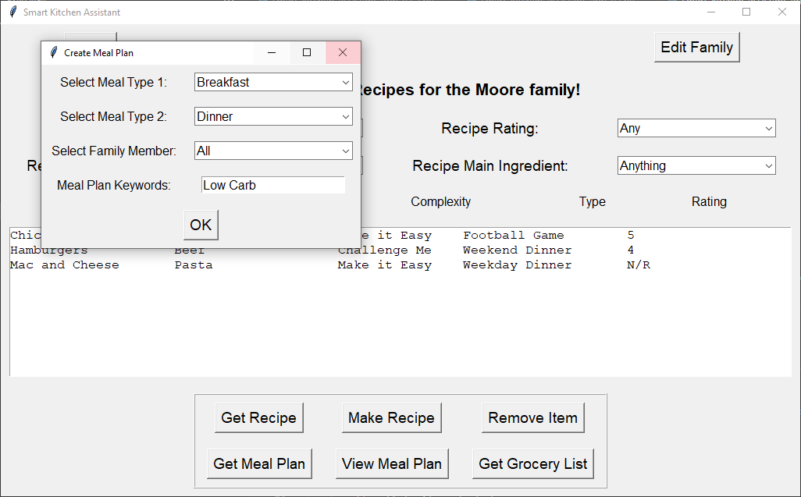

# Smart Kitchen Assistant Developer's Guide

## Overview
The Smart Kitchen Assistant is a Tkinter-based application designed to help families manage their kitchen by providing a platform to store and manage family profiles, recipes, dietary restrictions, and meal plans. This guide aims to provide developers with the necessary information to understand, maintain, and extend the application.

## Final Planning Specs
The application implements the following functionalities:
- User-friendly interface for managing family profiles and recipes.
- Ability to filter recipes based on user preferences such as dietary restrictions and meal types.
- Integration with the OpenAI API to fetch personalized recipes based on family members' preferences.
- Saving and loading family profiles and recipes from a JSON file.

## Installation and Deployment
To run the Smart Kitchen Assistant application:
1. Ensure Python 3.x is installed on your system.
2. Install the required libraries:

   pip install requests python-dotenv tkinter

3. Create a `.env` file in the project directory containing your OpenAI API key:

   OPENAI_API_KEY=your_api_key_here

4. Run the application:

   python main.py

## User Interaction and Data Flow
The Smart Kitchen Assistant application guides users through a series of screens where they can manage their kitchen and family recipes. The flow of user interaction is designed to be intuitive, allowing users to easily navigate through various functionalities.

### Welcome Screen
The application starts with a welcome screen that allows users to select or add a family profile. Users can choose from existing family profiles or add a new one.

**Data Flow**:
- **Data Storage**: Family profiles are stored in a JSON file (`profiles.json`), which is loaded when the application starts.
- **Functionality**: The `load_profiles()` function reads the JSON file and populates the `family_profiles` dictionary, making it accessible throughout the application.

### Main Menu
After selecting a family profile, users are taken to the main menu, where they can perform various tasks such as filtering recipes, creating meal plans, and managing family members.

**Data Flow**:
- **Data Access**: The selected family profile data is accessed via `self.family_profiles[self.family_name]`, allowing the application to retrieve relevant information for that family.
- **Functionality**: The `show_main_menu_screen()` method populates the interface with relevant options and calls methods like `populate_recipe_list()` to display recipes associated with the selected family.

### Recipe Filtering
Users can filter recipes based on dietary restrictions, meal types, and other preferences. Dropdown menus allow users to select filtering criteria.

**Data Flow**:
- **Data Handling**: The filtering process utilizes methods like `filter_members()` to refine the list of family members based on user selections. The selected criteria affect how recipes are displayed.
- **Functionality**: The `sort_recipes()` method filters the recipes in `self.family_profiles[self.family_name]["recipes"]` based on user input, allowing for a customized view of the recipe list.

### Editing User Families
Users can add, remove and modify members of each saved family.  Things that can be edited are Name, Age, Dietary Restrictions, and Favorite Foods.

**Data Flow**:
- **Data Handling**: The filtering process utilizes methods like `filter_members()` to refine the list of family members based on user selections. The selected criteria affect which members are displayed
- **Functionality**: The `add_member()` method adds a new member to the chosen family, edit allows the user to change the member info, remove deletes the member from the app.

### Meal Plan Creation
Users can create a meal plan by selecting meal types and specifying family members. This involves generating a collection of recipes tailored to the family's preferences.

**Data Flow**:
- **Data Modification**: The selected meal types and family members influence the recipes included in the meal plan. The `create_meal_plan()` method constructs a new meal plan object that aggregates relevant recipes based on user input.
- **Functionality**: The created meal plan is then saved back into the family profile using the `save_profiles()` method, which updates the `profiles.json` file to reflect the new meal plan.

### Meal Creation
Users can generate a new recipe using an LLM API and the user info gathered by the app.  

**Data Flow**:
- **Data Modification**: The app compiles the family information with the recipe request information into a single prompt that is then fed to an LLM API.  
- **Functionality**: The LLM returns a meal in a specific format that allows for processing and display.  

### Key Classes and Functions
Understanding how data flows through the application is crucial for maintaining and extending its functionality. Below are key classes and functions that handle user data:

- **SmartKitchenAssistantApp**: The main application class that handles user interactions.
  - **load_profiles()**: Loads family profiles from a JSON file into the application.
  - **show_welcome_screen()**: Displays the initial family selection interface.
  - **show_main_menu_screen()**: Displays the main menu for recipe management.
  - **populate_recipe_list()**: Updates the recipe list based on the selected family profile and current filtering criteria.
  - **sort_recipes()**: Filters the available recipes based on user-selected criteria, modifying what is displayed in the UI.
  - **get_recipe()**: This isn't that actual call to the API but it's the function that kicks off the process and starts determining if the relivent data is avaliable.

### Data Lifecycle in the Application
1. **Loading Data**: Family profiles are loaded from a JSON file at startup.
2. **User Interaction**: Users interact with the UI, selecting or adding family profiles, filtering recipes, and creating meal plans.
3. **Data Modification**: User selections modify the in-memory data structures that hold family profiles and recipes.
4. **Saving Data**: Changes made by the user, such as adding a meal plan or modifying a family member's details, are saved back into the JSON file using the `save_profiles()` function.

## Known Issues
### Minor Issues
- The application may sometimes fail to load profiles if the JSON file is not correctly formatted.
- Some dropdowns may not populate correctly if family profiles are empty.
- The grocery list items don't combine correctly for meal plans.
- The family members don't always add/save correctly.

### Major Issues
- API calls may fail without proper error handling.
- The application doesn't handle cases where the user selects an invalid recipe, which can lead to crashes.
- The recipes from the LLM don't always make sense.
- The recipes become repetative.

## Future Work
- Implement a more sophisticated error handling mechanism to manage API failures more gracefully.
- Add unit tests to cover critical functions and improve maintainability.
- Enhance the UI/UX for a better user experience.
- Enhance the recipe prompt.

## Ongoing Development
Regular updates and maintenance are encouraged to ensure the application remains functional and bug-free. Developers should consider:
- Implementing a version control system for tracking changes.
- Creating a test suite to validate functionality after changes.
- Perform MVP user testing to understand value to user.